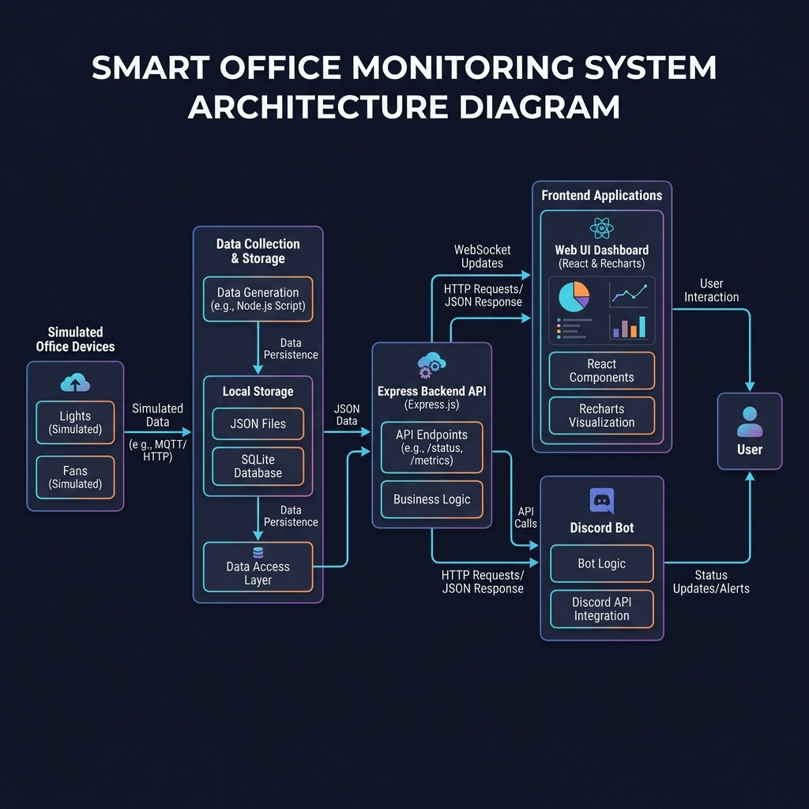
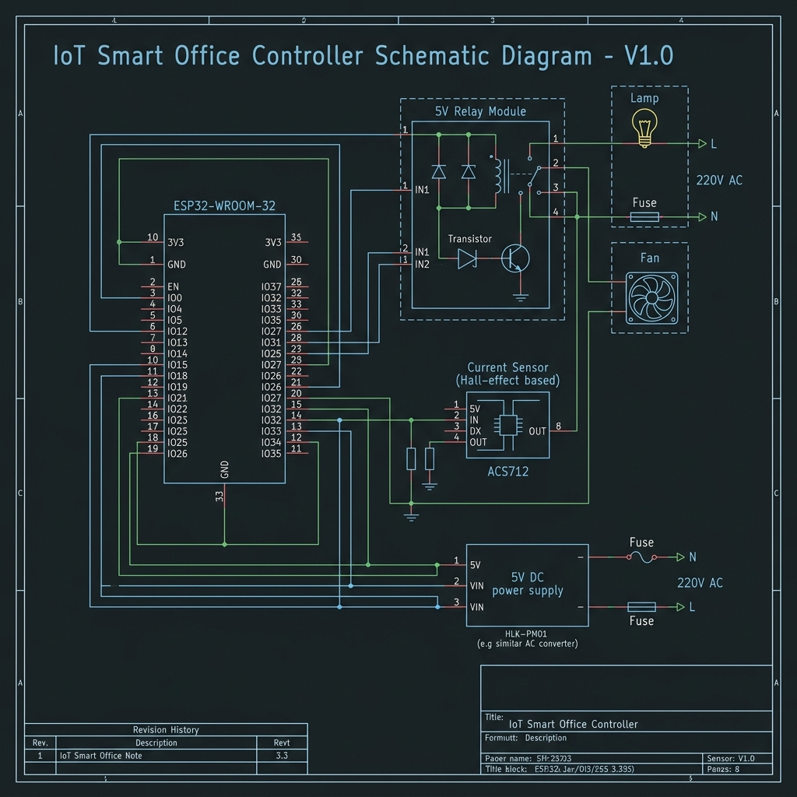

# Smart Office Monitor

[](https://expressjs.com)
[](https://react.dev)
[](https://tailwindcss.com)
[](https://discord.js.org)

A real-time IoT monitoring solution for smart offices. The system connects simulated device data, a live web dashboard, and a Discord bot through a shared backend.

---

## Key Features

### Web Dashboard
- **Office Floor Plan**: A top-down visual map of all rooms showing the live on/off state of every light and fan.
- **Animations**: Fans animate when active; lights glow when ON.
- **Live Power Meter**: Real-time per-room and total power consumption in Watts.
- **Alerts Panel**: Automatic detection of devices left on after office hours (9 AM - 5 PM) or continuously active for more than 2 hours.
- **Analytics**: Historical power consumption graphs and device activity trends.

### Discord Bot
- **Live Queries**: Pull real-time device and power data directly from the shared backend.
- **Proactive Alerts**: Automatically posts to a designated channel when an alert condition is triggered.

---

## System Architecture

The system uses a single source of truth (`db.json`) with the following data flow:



---

## Hardware/Electrical Schematic

A representative circuit for a single office room showing how an ESP32 microcontroller interfaces with relays to monitor lights and fans:



---

## Installation & Setup

### Prerequisites
- Node.js 20+ and npm
- A Discord Bot Token (from the [Discord Developer Portal](https://discord.com/developers/applications))

### 1. Backend & Simulator

Runs the API server on Port 3001 and the device simulator concurrently.

```bash
cd backend
npm install
npm start
```

### 2. Frontend Dashboard

Runs the React/Vite dev server on Port 5173.

```bash
cd frontend
npm install
npm run dev
```

### 3. Discord Bot

Create a `.env` file in the `bot` folder using `.env.example` as a template, then start the bot:

```bash
cd bot
npm install
# Create bot/.env with your DISCORD_TOKEN
npm start
```

---

## Discord Bot Commands

| Command | Description |
|---|---|
| `!status` | Overview of all room device statuses. |
| `!room <name>` | Status of a specific room (e.g., `!room drawing` or `!room work1`). |
| `!usage` | Total office power draw and daily kWh estimate. |
| `!alerts` | Currently active alerts and anomalies. |
| `!help` | List all available commands. |

---

## Team

**Institution:** Ahsanullah University of Science and Technology

| Role | Name | Contact |
|---|---|---|
| Team Leader | Tanjim Islam Turja | tanjimturjaturja@gmail.com · 01968708966 |
| Member | Enid Hasan | — |
| Member | Shuvrato Bhattacharjje | — |
| Member | MD. Tanjim Islam | — |

Alternative contact: 01777844618