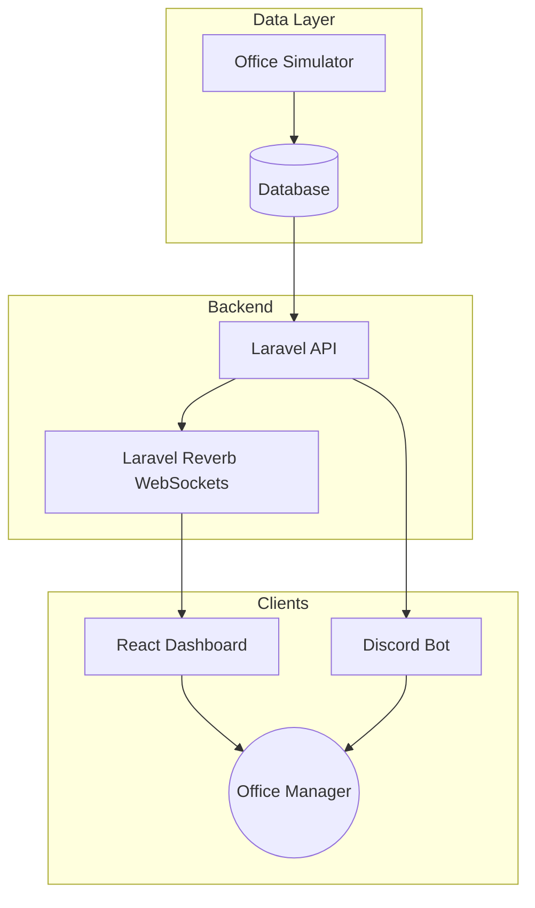

# 🏢 Smart Office Monitor: Modern Operations Center

[](https://laravel.com)
[](https://react.dev)
[](https://tailwindcss.com)
[](https://discord.js.org)

> A premium, real-time IoT monitoring solution for modern offices. Built for the Techathon National Finals, this system bridges the gap between simulated device data, a high-aesthetic dashboard, and a conversational Discord AI.

---

## 🚀 Key Features

### 🖥️ Interactive Dashboard
- **Top-Down Office Visualization**: An SVG-powered interactive floor plan with dynamic assets.
- **Micro-Animations**: Fans rotate when active; lights feature a realistic radial-gradient glow.
- **Live Energy Metering**: Real-time wattage breakdown for Drawing Room, Work Room 1, and Work Room 2.
- **Smart Alerts**: Automatic detection of devices left on after office hours (9 AM - 5 PM).

### 🤖 Intelligent Discord Bot
- **Conversational Queries**: Ask `@OfficeBot` about usage patterns in natural language.
- **Rich Embeds**: Visual status reports for every room with detailed icons.
- **Proactive Notifications**: Automatic alerts pushed to discord when anomalies are detected.

### ⚡ Technical Excellence
- **Real-Time Engine**: Powered by **Laravel Reverb** (WebSockets) for sub-second synchronization.
- **Simulation Layer**: Realistic device state toggling and power fluctuation simulation.
- **Clean Architecture**: Decoupled Frontend, Backend, and Bot layers sharing a single source of truth.

---

## 🛠️ Tech Stack

- **Frontend**: React 18, Vite, Tailwind CSS, Framer Motion, Lucide Icons, Recharts.
- **Backend**: Laravel 11, PHP 8.2+, SQLite (local) / MySQL (prod).
- **Real-time**: Laravel Reverb, Laravel Echo.
- **Bot**: Node.js, Discord.js, Axios, OpenAI/Gemini (LLM Mode).

---

## 🏗️ System Architecture



---

## 📸 Visual Walkthrough

### Interactive Dashboard


### Discord Bot Interaction


## 🎥 Video Demo
[Watch the full walkthrough here](https://your-video-link.com) (Max 3 minutes)

---

## ⚙️ Installation & Setup

### 1. Prerequisites
- PHP 8.2+ & Composer
- Node.js 20+ & npm
- A Discord Bot Token

### 2. Backend Setup
```bash
cd backend
composer install
cp .env.example .env
php artisan key:generate
php artisan migrate --seed
php artisan serve
```

### 3. Frontend Setup
```bash
cd frontend
npm install
npm run dev
```

---

## 📈 Roadmap & Status
- [x] UI/UX Design & SVG Map
- [x] Backend Scaffolding & API
- [ ] Real-time Simulation & Reverb
- [ ] Discord Bot LLM Integration
- [ ] Final Deployment

---

## 📄 License
This project was developed for the **Techathon National Finals**. All rights reserved.

---

*Built with ❤️ by the Smart Office Team.*